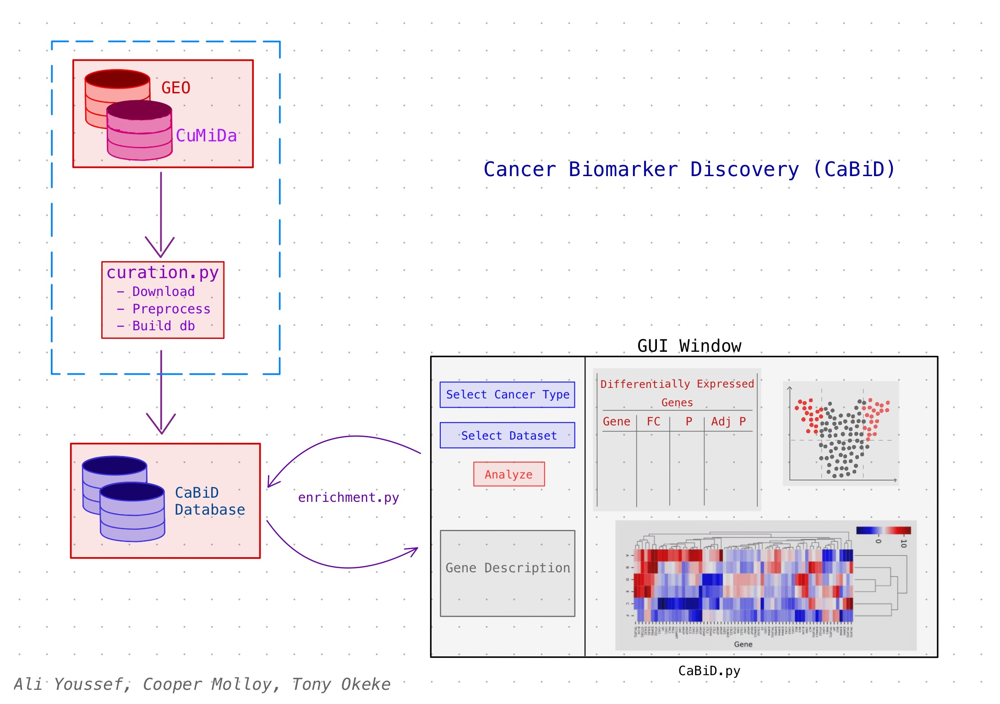
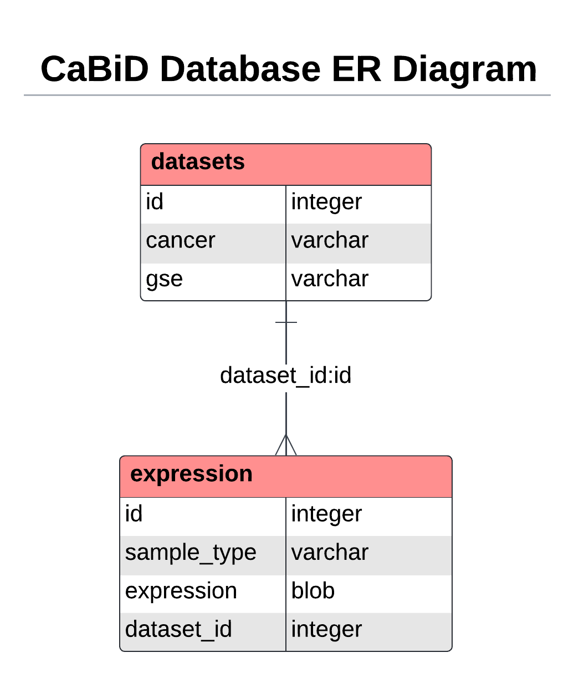

# Cancer Biomarker Discovery (CaBiD) Project

**Authors:** [Tony Kabilan Okeke](mailto:tonykabilanokeke@gmail.com),
             [Ali Youssef](mailto:amy57@drexel.edu),
             [Cooper Molloy](mailto:cdm348@drexel.edu)

## Project Proposal

The goal of this project is to develop a web application to investigate
variations in gene expression across various cancer types. Datasets selected
from GEO (Gene Expression Omnibus) and CuMiDa (Curated Microarray Database)
will be preprocessed and curated in a SQLite database. The wxPython package
will then be used to develop a GUI application that will generate visualizations
of the user-selected dataset. The software will identify key differences in gene expression between healthy controls and tumoral samples across various cancer
types. The GUI will include heatmaps and volcano plots to visualize the
differences in gene expression, along with a table of the significantly
differentially expressed genes. To find out more about the project, please
take a look at the [project report](report.pdf). You can also take a look at
the [project design document](design.pdf).

## Usage

Run the following commands in your terminal to set up the environment for
running our application, build the database, and run the application.  

> **Note:** The CaBiD GUI depends on wxPython, which may not be compatible with
> some Linux distributions. If you are using Linux, you may need to install
> gtk3 and wxPython from [source](https://wxpython.org/pages/downloads/).
> Also, for grading purposes, please use the `bmes550` branch of this repository.

```bash
# Clone the repository
git clone -b bmes550 git@github.com:Kabilan108/CaBiD.git
cd CaBiD

# Set up conda environment
conda env create -f env.yml
conda activate cabid

# Download necessary data and build the project database
python src/curation.py

# Run the GUI
python src/gui.py
```

## Project Sketch

<p align="center">
  
</p>

## Database Schema

Below is the database schema for the SQLite database that will be used to
store the curated datasets. The database will contain two tables: `datasets`,
which will store the metadata for each dataset, and `expression`, which will
store the gene expression data for sample (patient).

<p align="center">
  
</p>

## Folder Structure

```
.
├── design.pdf        [Contains project design flowchart]
├── env.yml           [Contains a list of project dependencies]
├── ERD.png           [Contains the database schema]
├── index.yml         [Contains project details]
├── INSTRUCTIONS.md   [Contains instructions for BMES 550 project]
├── LICENSE.md        [Project license]
├── README.md         [Contains project description and usage instructions]
├── report.pdf        [Contains project report]
├── sketch.jpg        [Contains project sketch]
├── src               [Contains project source code]  
│   ├── curation.py   [Script for building the project database]
│   ├── dge.py        [Module for differentially expressed gene analysis]
│   ├── gui.py        [Script for running the GUI]
│   └── utils.py      [Module with custom functions and classes]
└── thumb.png         [Project thumbnail]
```

## Potential Improvements and Further Development

- Add more datasets to the database.
- Allow users to upload their own series matrix files for analysis.
- Utilize the `limma` package in R to perform differential expression analysis
  to generate more accurate results.
